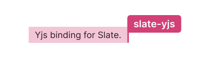

 

  

Slate-yjs aims to be the goto collaboration solution for slate. Get started in seconds, scale to infinity, customize to your hearts content.

 

  

 

  <a href="#sponsors-"><strong>Sponsors</strong></a> ·
  <a href="#why-yjs"><strong>Why Yjs?</strong></a> ·
  <a href="https://slate-yjs.dev"><strong>Live demo</strong></a> ·
  <a href="https://docs.slate-yjs.dev"><strong>Documentation</strong></a> ·
  <a href="#packages"><strong>Packages</strong></a> ·
  <a href="#products"><strong>Products</strong></a> ·
  <a href="#questions"><strong>Questions</strong></a> ·
  <a href="#contributing"><strong>Contributing!</strong></a>

 

 

## Sponsors 💖

I'm currently looking for sponsors to found further development of slate-yjs. These awesome sponsors already fund the development:

<table>
  <tr>
    <td align="center">
      <a href="https://www.sanalabs.com/">
         
        <strong>Sana Labs</strong>
      </a>
    </td>
  </tr>
</table>

 
 

Hosting provided by:

  

 
 

## Why Yjs?

Yjs offers a feature-rich rich text CRDT with best-in-class performance. It's used in production by multiple fortune 500 companies and is the core of many collaborative editing applications. Moreover, it offers a very mature ecosystem with server-side solutions like [hocuspocus](https://www.hocuspocus.dev/), enabling you to build robust and highly scalable collaborative/offline-first applications.

For more detailed benchmarks about performance, you can take a look [here](https://github.com/dmonad/crdt-benchmarks).

Why a CDRT over OT? While many current collaborative text editing applications rely on OT (e.g., google docs with ShareJS), it only provides a subset of the functionally CRDTs offer due to the dependence on a central server. In other words: CRDTS can do everything OT can, but OT simply can't.

You can read more about this [here](https://josephg.com/blog/crdts-are-the-future/).

 
 

## Live demo

https://slate-yjs.dev

 
 

## Documentation

https://docs.slate-yjs.dev

 
 

## Packages

Slate-yjs's codebase is monorepo managed with [yarn workspaces](https://yarnpkg.com/features/workspaces). It consists of a handful of packages—although you won't always use all of them:

| **Package**                            |                                                                                                          **Version** |                                                                                                                                                       **Size** | **Description**                                | **Changelog**                                                                                |
| :------------------------------------- | -------------------------------------------------------------------------------------------------------------------: | -------------------------------------------------------------------------------------------------------------------------------------------------------------: | :--------------------------------------------- | -------------------------------------------------------------------------------------------- |
| [`@slate-yjs/core`](./packages/core)   |    |    | Core slate-yjs binding.                        | [CHANGELOG.md](https://github.com/BitPhinix/slate-yjs/blob/main/packages/core/CHANGELOG.md)  |
| [`@slate-yjs/react`](./packages/react) |  |  | React specific components/utils for slate-yjs. | [CHANGELOG.md](https://github.com/BitPhinix/slate-yjs/blob/main/packages/react/CHANGELOG.md) |

 
 

# Products

These products use slate-yjs, and can give you an idea of what's possible:

- [Dropdeck](https://dropdeck.com/)
- [Hugo](https://hugo.team/)
- [Living Spec](https://www.livingspec.com/)
- [Saga](https://saga.so/)
- [Sana](https://www.sanalabs.com/)

 
 

## Questions?

For questions around yjs, head over to the [Yjs Community](https://discuss.yjs.dev/). Trying to build a backend with [hocuspocus](https://www.hocuspocus.dev/) and have questions? Take a look at the #hocuspocus channel in the [TipTap Discord](https://discord.com/invite/WtJ49jGshW). Having issues with slate? There's a there's a [Slack](https://slate-slack.herokuapp.com/) for that as well.

Any questions about slate-yjs? Thead over to the #slate-yjs channel inside the [Slate Slack](https://slate-slack.herokuapp.com/) or post something in the [Discussions](https://github.com/BitPhinix/slate-yjs/discussions)

 
 

## Contributing!

All contributions are super welcome! Check out the [contributing instructions](https://docs.slate-yjs.dev/contributing/contributing) for more info!

Slate-yjs is [MIT-licensed](https://github.com/Bitphinix/slate-yjs/blob/main/LICENSE.md).
